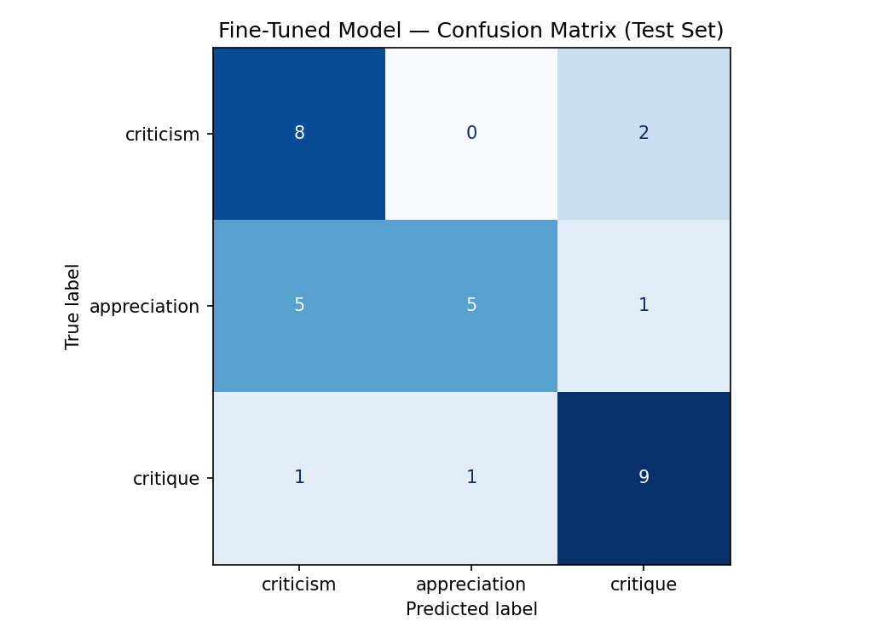

# ai201-project3-takemeter

## community
The community I chose is 'Let's Talk Music' from the Reddit subdirectory r/LetsTalkMusic. 
This community is dedicated to passionate music enthusiasts engaging in stimulating, in-depth discussions. Members actively ask questions, share personal insights, offer recommendations, and analyze musical works. The discourse spans balanced critiques, positive appreciations, and direct criticisms of musicians and their art.

## Data Annotation 
### Data source
The primary data source for this project consists of posts and comments from the r/LetsTalkMusic subreddit.

### labeling process
I have come up with three labels for this project. While there can be more labels to categorize the posts in this community, I found that most of the posts can be classified into three labels. I was thinking to add another label as `discussion_prompt` because some of the posts include questions rather than any suggestions, views, or opinions. But, I thought that this could confuse the model as almost all the posts contain at least one or more questions. Therefore, I decided not to use it and stuck with these three instead. The following is the reasoning behind these labels.

`criticism`: A label I came up with after analyzing many posts. Some threads carry relatively unfavorable, negative, or disapproving remarks toward a musician, band, their work,and other sometimes even utilizing harsh language. While minor positive remarks may occasionally be present, they do not dominate the overall unfavorable, negative tone.

`appreciation`: This label captures posts that are distinctly favorable toward a particular artist or their work. While these posts might contain minor negative caveats, the overall tone and attitude remain highly positive, celebratory, and supportive of the musician or band.

`critique`: I assigned this label to posts that offer a balanced, neutral, and analytical way of presenting ideas. While I could have split this into two separate labels—`analysis` and `critique`—I decided to keep them under one unified label, `critique`. The reason for this is that while this community hosts highly interesting discussions, these posts are not necessarily at an academic level. Therefore, the analysis or critique can be more informal and may not have a clear boundary to distinctly identify them as separate categories. Nonetheless, as analysis and critique go hand in hand here, I decided to keep such posts under one label `critique`.


### Why does this distinction matter ?
I believe these distinctions are important for community members so they can easily search for what others think of their favorite artists or discover different perspectives on an artist's work. Additionally, these labels can assist students in this community by helping them find intriguing ideas for their academic literacy courses.

### label definitions and examples
<!-- add examples later -->
`criticism`: The text expresses a primarily negative, disapproving, or frustrated view of an artist's work, a specific genre, an industry trend, or common listener behaviors; while minor positive remarks may be present, they do not dominate the overall unfavorable tone.

> example 1:
It gets hate because a lot of it is cheap auditory tricks, shady artist and too energetic for any sober person.I find it either exhausting or repetitive. 
Then from a social standpoint it's really hard to support some of these artist.You've got countless guys like Bassnectar going down for being sexual predators.

> example 2:
Eminem gets way more credit than he deserves, I think. There is a lot of filler garbage on every single one of his albums. He makes killer singles and that's why people love him so much. 
But when I listen to his albums I find myself skipping through 3/4 of the tracks.

> example 3 ( borderline case ) : criticism / critique
I feel like it used to be easier to put artists into a specific category. Rock was rock, hip-hop was hip-hop, country was country. Now it seems like a lot of artists pull influences from everywhere. You can hear rap, pop, electronic, rock, R&B, and indie influences all in the same song. Part of me thinks that's one of the coolest things happening in music right now. Another part wonders if genres are starting to lose their meaning altogether. Do you think genres still matter as much as they used to, or are we moving toward a world where music is just music?

Note: Based on the decision rules( decribed below ), I assigned the label `critique` for this post.

`appreciation`: The text expresses a primarily positive, admiring, and appreciative view of the artist's past or present albums and songs; while minor negative remarks may be present, they do not dominate the overall favorable tone.

> example 1: 
Social media is the best thing that's ever happened to music today because it allows people to find artists and songs they never would have before. Artists like the ones listed above would never have been found without social media and considering their drastic divergences from what is the norm now in hip-hop they probably never would have gathered a fan base.

> example 2: 
It's all on how you consume it. I'm a guitar player, and i'm in a bunch of guitar-related groups on Facebook. It's interesting info, but I can't say I've been influenced one way or the other due to those. I do appreciate a good meme, though.The biggest way that social media has probably influenced me musically is when I discovered John Mayer's instagram live videos (bunch on youtube now). Not only is the guy hilarious and smart, but occasionally he'll do a 30min-1 hour instagram live where he gives guitar tricks and tips. Has been quite influential to me personally, and i'm not even a huge fan of his own music.

> example 3 ( borderline case ): critique/appreciation
So in the past week, I've seen a trend where people say "maturing is realizing that Lauryn Hills music is about God" and I got confused because that was not how I interpreted it. This is not fact just my opinion and I would like to hear yours,do you agree or I'm an idiot?

The Miseducation of Lauryn Hill is one of the best albums ever created, not just by a female artist, but of all time. Yet there is still a lot of misinterpretation of this work. This album is not about God. Lauryn Hill uses God as a moral judge of problems on Earth, she calls on God for help and repentance. She is not talking about God, she turns to God seeking help.

"Tough Love" is the main topic of this album. The idea, prevalent in Black communities, that a child's first bully is their parents, who harden them to prepare them for the racism out in the world. This is the type of love Lauryn has been gaslit into believing is true love. In the process of unlearning this, Lauryn Hill realizes that this love is a result of fear. Fear of all the things out in the world, fear passed down through generations, generational trauma. Perpetrators usually think they are protecting their children yet they end up becoming the exact monsters they fear.

Song Analyses  
Ex-Factor: The Anatomy of Abuse
"Ex-Factor" is the richest song on the album in terms of depth. It talks about Lauryn's experience in an abusive relationship where her partner resorts to self-harm and manipulation to keep her. Lauryn admits to wanting the relationship to continue, that she loves her partner, but understands that this cannot carry on. She cannot keep being lied to, exploited and abused, having the very values she was taught love was completely undermined.

Doo Wop (That Thing): A Warning  
"Doo Wop (That Thing)" is Lauryn warning the youth about gold digging women and male gangsters, liars and manipulators. She is telling the youth to respect themselves and their significant others because this kind of love will cost them.

When It Hurts So Bad: The Sequel  
"When It Hurts So Bad" is kind of a sequel to "Ex-Factor." A continuation of Lauryn trying her hardest to keep the relationship going but just keeps hurting herself in the process, while simultaneously moving on to better men yet still chasing the feeling she is infatuated with. What she wants is hurting her while she overlooks the type of love she actually deserves.

Forgive Them Father: The Turning Point  
"Forgive Them Father" is the most important song on the album. Lauryn turns to God praying for forgiveness on behalf of her abusers, manipulators and wolves in sheep's clothing. She questions and confronts the men who hurt her yet still prays for them, claiming they do not know what they are doing, that they are just perpetuating the hate they received themselves, guised in love and guidance. This is Lauryn letting go and accepting that "everything is everything," whatever happened to her was meant to happen for her to grow. She learns to forgive and move on.

Nothing Even Matters: The Arrival  
"Nothing Even Matters" is Lauryn Hill maturing and discovering what love truly is. Love is a harmless drug and "what if I go through withdrawals." She does not care what people think anymore because nothing even matters except love. She does not need to dress up or do her hair for love. This song embodies Black, gentle coconut oil love. After everything she has been through, she now knows what love is and nothing else matters.

Note: Based on the decision rules( decribed below ), I assigned the label `appreciation` for this post.

`critique`: The text provides an objective, analytical evaluation of the music's structural or artistic elements (such as production, lyricism, or historical context), utilizing systematic reasoning and evidence rather than purely emotional preferences or personal venting.

> example 1:
I think the main reason pre-60s pop vocals sound antiquated is that the conventions of the time were very traditional and conservative. Pop music as we know it emerged in the 50s as a completely new musical paradigm, yet its song structure, lyrical content, and melodic harmonies remained strongly tied to the traditional music from which early pop heavily borrowed. Pre-1960s pop vocal melodies tend to be tightly tethered to the melodic structure of the song, which are often based on simple, tonal chord progressions. Lyrically, songwriters then—just as they do today—strived to appeal to a broad audience by offering accessible and immediately relatable content. Pop of the 1960s, in large part, retained these fundamental characteristics. It is important to remember that the exemplars of the age are not representative of the whole; while groups like The Beatles and The Beach Boys were pushing the boundaries of commercial pop, many acts were satisfied simply with selling singles. For example, 1967 was the year The Beatles released Sgt. Pepper’s, yet the following year, the highest-charting songs included "Honey" by Bobby Goldsboro and "This Guy’s in Love With You" by Herb Alpert. I am sure neither of those songs are recognizable to a modern audience; in fact, they likely sound just as antique as anything from the 50s. I guess my point is that it is important to be fair about what the pop scene was really like, because although there were some timeless standouts, most songs were just pop songs like any other: simple, singable, danceable, predictable, and, most importantly, commercial.

> example 2:
We haven't had a major shake up in 25 years, something so profound that not only does it shake up the music industry, but it also changes culture. Yes, we've all heard the explanations before, lack of a mono culture, algorithms, the music industrys monopoly, no more gate-keepers, social media, technology, the overwhelming amount of music, etc, etc. But since any sort of anti-establishment, seismic shift has always been fueled by the "younger generation"--I'm just not seeing any potential backlash/anger towards the mainstream with all this dopamine decadence. And it occurred to me...it might take a Gen X'er to spark a potential music revolution. There's an entire generation that only knows screen addiction, commercial music, influencers, content creation, etc. Hardly the danger we once had.That older age demographic has gone through it all, several music/cultural revolutions, turbulent times, they know what it's like to fight against the establishment, they lived through the music ideals like danger, authenticity, irreverence, controversey, recklessness, etc. My point is--since the younger generation seems to be apathetic towards actual change, it might be a bitter, resentful, angry older, band/artist to stir shit up again.

> example 3 ( borderline case ): critique /criticism
(Oh boy I’m going to get downvoted for this I can already tell) There’s actually one specific problem I have with it that I’ve never seen anyone bring up, but I think is a pretty significant flaw. Where are the band members besides Brian? Occasionally there’ll be like 1 or 2 other members and for the most part that’s it. It kind of makes me wonder what the point of bringing all these session musicians in if you’re not going to use your actual band mates that much. Obviously the songs themselves are great, I’m not going to pretend that this ruins the album for me and that it’s now a 0/10, it’s just that I’m not sure why this is a beach boys album and not a Brian Wilson solo project. Obviously though, the album itself is astronomically exceptional. I would just love to hear other people’s thoughts on this because it does genuinely bug me a little bit. 

Note: Based on the decision rules( decribed below ), I assigned the label `criticism` for this post.

### Label Distribution 
The dataset contains a total of 207 posts and comments. To ensure a balanced dataset, the examples are distributed evenly, with 69 examples (representing exactly 33.3% of the dataset) assigned to each of the three labels.

### Hard Edge Cases & Decision Rules

I have found that the most challenging posts to classify sit on the boundaries between `criticism` and `critique`, or between `appreciation` and `critique`. 

### The Core Problem: Sentiment Count vs. Textual Intent
We cannot accurately classify these posts by merely counting positive and negative words. For example, a high number of positive words does not automatically mean a post belongs to `appreciation`, nor does an equal balance of positive and negative words automatically make it a `critique`. 

### My Strategic Decision Rule: Core Argument Analysis
To handle these ambiguous cases consistently, my strategy is to isolate and evaluate the **main theme or central argument** of the post using a structured layout analysis:

1. **Locate the Thesis:** I will look primarily at the first sentence/paragraph (where the author usually introduces their core view) and the final paragraph (where they often paraphrase their conclusion). 
2. **Evaluate the Contextual Core:** I will treat the middle of the post as supporting evidence. If the middle sections use analytical language to pick apart musical mechanics, the post leans toward `critique`. If the middle sections are purely an emotional vent or a declaration of fandom, it will be guided toward `criticism` or `appreciation` respectively. 
3. **The Role of Word Counting:** While counting positive and negative words can serve as a supplementary feature to gauge the tone, the final classification decision will always prioritize the structural intent of the argument over raw word counts. However, as a general rule of thumb, `appreciation` posts typically have a higher concentration of words indicating a positive, admiring, and celebratory view of the artist's past or present work, whereas `criticism` posts have a higher density of words indicating a negative, disapproving, or frustrated perspective. Meanwhile, `critique` posts feature a balanced distribution of both positive and negative remarks, focusing heavily on objective, analytical elements.

## Fine-tuning pipeline
** Model used :** `distilbert-base-uncased`, the base pre-trained model from the `HuggingFace` hub.

**The training approach:** supervised fine-tuning (SFT)

**Tools used:**
    - Google Colab (free GPU) with Free T4 GPU

**Training Libraries:**
- `transformers`: The core library used to load the pre-trained model, handle tokenization, and manage the training loop.
- `datasets`: Used to convert your pandas DataFrames into a memory-efficient Hugging Face Dataset object optimized for training deep learning models.
- `scikit-learn`: Used for data splitting, model evaluation metrics, and confusion matrix visualization

**Hyperparameter Tuning & Decisions:**
Initially, using the starter code's default settings—3 epochs, a learning rate of 2e-5, and a batch size of 16—the fine-tuned model significantly underperformed, dropping in accuracy by 25% compared to the zero-shot baseline classifier.

To mitigate this and stabilize training on the small dataset, I modified the hyperparameters by increasing the duration to 4 epochs and lowering the learning rate to 1e-5. This adjustment successfully prevented aggressive weight updates, lifting the model's final performance to within just 3.12% of the baseline classifier's accuracy.

## Baseline Comparison

### Zero-Shot Prompt Design
The baseline model used for evaluation was `llama-3.3-70b-versatile` hosted via the Groq API. To establish a rigorous zero-shot baseline, a structured system prompt was engineered containing precise definitions for the three target classes (`criticism`, `appreciation`, and `critique`) alongside a representative text example for each category drawn from the r/LetsTalkMusic community context. The model was strictly instructed to output *only* the matching label name to guarantee deterministic parsing.

**Prompt used** 

```text
You are classifying posts AND comments from r/LetsTalkMusic.
Assign each post to exactly one of the following categories.

criticism: The text expresses a primarily negative, disapproving,
or frustrated view of an artist's work, a specific genre, an industry trend,
or common listener behaviors; while minor positive remarks may be present,
they do not dominate the overall unfavorable tone.
Example: "It gets hate because a lot of it is cheap auditory tricks, shady artist and
too energetic for any sober person.I find it either exhausting or repetitive.
Then from a social standpoint it's really hard to support some of these artist.
You've got countless guys like Bassnectar going down for being sexual predators."

appreciation: The text expresses a primarily positive, admiring, and appreciative view
of the artist's past or present albums and songs;while minor negative remarks may be present,
they do not dominate the overall favorable tone.
Example: "Social media is the best thing that's ever happened to music today
because it allows people to find artists and songs they never would have before.
Artists like the ones listed above would never have been found without social media
and considering their drastic divergences from what is the norm now in hip-hop
they probably never would have gathered a fan base."

critique: The text provides an objective, analytical evaluation of the music's structural
or artistic elements (such as production, lyricism, or historical context), utilizing systematic
reasoning and evidence rather than purely emotional preferences or personal venting.
Example: "I think the main reason pre-60s pop vocals sound antiquated is that the conventions of
the time were very traditional and conservative. Pop music as we know it emerged in the 50s
as a completely new musical paradigm, yet its song structure, lyrical content,
and melodic harmonies remained strongly tied to the traditional music from which
early pop heavily borrowed. Pre-1960s pop vocal melodies tend to be tightly
 tethered to the melodic structure of the song, which are often based on simple,
 tonal chord progressions. Lyrically, songwriters then—just as they do today—strived to appeal to a broad audience
by offering accessible and immediately relatable content. Pop of the 1960s, in large part,
retained these fundamental characteristics. It is important to remember that the exemplars
of the age are not representative of the whole; while groups like The Beatles and The Beach Boys
 were pushing the boundaries of commercial pop, many acts were satisfied simply
 with selling singles. For example, 1967 was the year The Beatles released
 Sgt. Pepper’s, yet the following year, the highest-charting songs included "Honey"
 by Bobby Goldsboro and "This Guy’s in Love With You" by Herb Alpert.
 I am sure neither of those songs are recognizable to a modern audience; in fact,they
 likely sound just as antique as anything from the 50s.I guess my point is that it is important to be fair about what
 the pop scene was really like, because although there were some timeless standouts,
 most songs were just pop songs like any other: simple, singable, danceable, predictable, and, most importantly, commercial."

Respond with ONLY the label name.
Do not explain your reasoning.

Valid labels:
criticism
appreciation
critique
```
### Data Collection & ExecutionTest Evaluation: 
- **Test Evaluation:** The baseline was evaluated against the identical, locked test dataset split ($N=32$) utilized for the fine-tuned model to ensure a perfectly controlled comparison.

- **Inference Parameters:** Inference was executed with temperature=0 to ensure maximum consistency, and a strict max_tokens=20 limit. A systematic $0.1$-second rate-limiting delay was enforced between subsequent API calls to respect free-tier infrastructure caps. All $32$ model responses were successfully parsed into valid targets with zero unparseable failures.

### Performance Metrics Comparison
The following matrix documents the side-by-side evaluation metrics computed on the test set for both the Fine-Tuned DistilBERT model and the Zero-Shot Baseline (Llama 3.3 70B).

|Model|Classification Style|Test Accuracy|
|--------------|----------:|------------:|
|Zero-Shot Baseline (Llama 3.3 70B)|In-Context Learning (Prompted)|71.9% (23/32)|
|Fine-Tuned DistilBERT|Supervised Parameter Fine-Tuning|68.8% (22/32)|

Fine-Tuning Delta: $-0.031$ (The zero-shot baseline outperformed the fine-tuned model by a single test example baseline advantage)

### Per-Class Classification Breakdowns
**Zero-Shot Baseline (Llama 3.3 70B)**
|              | Precision | Recall | F1-Score | Support |
|--------------|----------:|--------:|---------:|--------:|
| criticism    | 0.56 | 0.90 | 0.69 | 10 |
| appreciation | 0.91 | 0.91 | 0.91 | 11 |
| critique     | 0.80 | 0.36 | 0.50 | 11 |
| **Accuracy** |  |  | **0.72** | **32** |
| **Macro Avg** | 0.76 | 0.72 | 0.70 | 32 |
| **Weighted Avg** | 0.76 | 0.72 | 0.70 | 32 |

**Fine-Tuned DistilBERT**
|        | Precision | Recall | F1-Score | Support |
|--------|----------:|--------:|---------:|--------:|
| criticism | 0.57 | 0.80 | 0.67 | 10 |
| appreciation | 0.83 | 0.45 | 0.59 | 11 |
| critique | 0.75 | 0.82 | 0.78 | 11 |
| **Accuracy** |  |  | **0.69** | **32** |
| **Macro Avg** | 0.72 | 0.69 | 0.68 | 32 |
| **Weighted Avg** | 0.72 | 0.69 | 0.68 | 32 |


## Evaluation Report and Error Analysis

### Performance Metrics & Comparative Analysis

The table below provides a detailed comparison of the fine-tuned model (DistilBERT) against the zero-shot baseline (Llama 3.3 70B) across overall accuracy and individual per-class metrics on the locked test set ($N=32$).

| Model / Metric | Overall Accuracy | Class: criticism (F1 / P / R) | Class: appreciation (F1 / P / R) | Class: critique (F1 / P / R) |
| :--- | :---: | :---: | :---: | :---: |
| **Zero-Shot Baseline** *(Llama 3.3 70B)* | **71.9%** | 0.69 / 0.56 / 0.90 | **0.91** / 0.91 / 0.91 | 0.50 / 0.80 / 0.36 |
| **Fine-Tuned Model** *(DistilBERT)* | **68.8%** | 0.67 / 0.57 / 0.80 | 0.59 / 0.83 / 0.45 | **0.78** / 0.75 / 0.82 |

#### Key Performance Insights:
* **The Fine-Tuning Regression:** Overall, the zero-shot baseline outperformed the fine-tuned model by a margin of **0.031** (representing exactly one test example baseline advantage).
* **The "Appreciation" Blindspot:** The baseline heavily dominated the `appreciation` class, securing a **0.91 F1-score** compared to DistilBERT's **0.59 F1-score**. The fine-tuned model suffered from low recall (**0.45**), frequently misclassifying nuanced praise as negative criticism.
* **The "Critique" Triumph:** Conversely, the fine-tuned DistilBERT model vastly outperformed the zero-shot baseline on the highly analytical `critique` category, securing a **0.78 F1-score** over Llama's **0.50 F1-score**. While Llama struggled with a low recall of **0.36** on these entries, DistilBERT successfully learned the structural boundaries of objective music analysis.

#### Confusion Matrix


| True \ Predicted | criticism | appreciation | critique | **Total Support** |
| :--- | :---: | :---: | :---: | :---: |
| **criticism** | **8** | 0 | 2 | *2* |
| **appreciation** | 5 | **5** | *11* |
| **critique** | 1 | 1 | **9** |


### Automated Error Analysis & Verification Methodology

To ensure a rigorous and unbiased evaluation of the fine-tuned model, the error analysis process was structured as a collaborative, two-stage pipeline combining automated AI pattern recognition with manual human verification.

#### 1. The Automated AI Analysis Plan
Rather than relying solely on individual guesswork, all 10 misclassified instances from the test set evaluation were compiled into a structured log containing the raw text data, the true target label, and the model's incorrect prediction. This compiled error dataset was passed to an LLM with a dedicated diagnostic prompt. 

The AI was instructed to bypass generic observations and systematically scan the text profiles for the following concrete linguistic and structural anomalies:
* **Contextual Lexical Inversion:** Pinpointing instances where sub-cultural communities or music fans utilize aggressive, intense, or traditionally "negative" vocabulary (e.g., *"growly"*, *"messy"*, *"shit"*) to express high praise.
* **Syntactic Shortcuts:** Detecting whether the model over-indexes on clean structural layouts (like repetitive parallel sentence constructions) as a false proxy for objective analysis.
* **Vague or Mixed Sentiment:** Highlighting rows where an author blends emotional praise and structural criticism closely together within the same short paragraph.

#### 2. Human Review & Verification Strategy
Automated language models are excellent at finding surface trends, but they can easily hallucinate patterns or misinterpret the true intent of a community post. To guarantee the integrity of this report, a strict manual verification protocol was applied to the AI's findings:
1.  **Ground-Truth Grounding:** Every failure pattern identified by the AI was cross-referenced directly back to the raw row outputs in the notebook to ensure the trend was mathematically supported by multiple examples.
2.  **Boundary Validation:** For each suspected pattern, the true label definitions established in our project planning phase were re-examined to verify if the text truly sat near a difficult classification boundary or if the model suffered a genuine systemic blind spot. 
3.  **Confidence Check:** The model's prediction probability scores were analyzed alongside the text to differentiate between areas where the model was completely fooled versus areas where it was simply experiencing a low-confidence split decision.

## Model Reflection: Performance vs. Deployment Targets

To determine if this fine-tuned model is ready to be used as an automated tool in a live music community, we measured its performance against two primary success targets.

### 1. Success Metrics & Final Verdict

* **Target 1: Baseline Accuracy**
    * *The Goal:* Overall accuracy must be significantly better than a purely random guess for a three-class task (which would be 33%).
    * *Actual Performance:* **68.8%** (22 out of 32 test examples correct).
    * *Verdict:* **PASSED.** The model performs more than double the rate of random guessing, proving it successfully learned meaningful patterns from our training data.
* **Target 2: Balanced Performance Across All Categories (F1-Score Corridor of 0.65 – 0.75)**
    * *The Goal:* Maintain a balanced, reliable scoring rate between 0.65 and 0.75 for all three community labels.
    * *Actual Performance:*
        * `criticism`: **0.67** ➔ **PASSED** (falls perfectly within our target window).
        * `critique`: **0.78** ➔ **PASSED & EXCEEDED** (outperformed expectations at identifying analytical text).
        * `appreciation`: **0.59** ➔ **FAILED** (fell short of our minimum threshold for safe deployment).

### 2. Why the Model Missed the Target: Key Failure Patterns

Instead of just needing "more data," the model struggled with two very specific cultural and stylistic patterns unique to community internet text.

#### Pattern A: Slang and "Negative" Words Used as Praise (`appreciation` misclassified as `criticism`)
The biggest barrier to deploying this model is its weak **45% recall** on appreciation posts—meaning it missed more than half of the positive comments. 

In music communities like r/LetsTalkMusic, fans frequently use aggressive or traditionally negative words to express intense praise (for example: *"growly sounds"*, *"darker sounds"*, or slang like *"even the new shit"*). Because our base model was originally trained on standard English text, it didn't understand this community-specific shorthand. It took those intense or profane words literally, flagged them as hostile, and incorrectly dumped nearly half of the positive appreciation posts into the negative `criticism` bucket.

#### Pattern B: Judging a Post by Its Layout over Its Meaning (`criticism` misclassified as `critique`)
While the model was excellent at recognizing analytical `critique`, it learned to rely on a shortcut: text formatting.

When a user wrote a post with a highly structured, orderly layout—like the repeating sentence blocks seen below—the model assumed the text must be an objective, evidence-based analysis. It looked at the superficial "neatness" of the writing and completely missed the fact that the user was actually just venting an opinionated grievance or complaint (`criticism`).

```text
--- Error #1 ---
Text:      I think humans thrive in small communities. I think fame, hierarchy, and commodification destroy communities. I think social media exacerbates fame, hierarchy, and commodification through the gamifica...
True:      criticism
Predicted: critique  (confidence: 0.39)

--- Error #10 ---
Text:      I’ve noticed that when I read interviews with cartoonists and poets, they tend to answer questions in a straightforward, relatable manner—like someone you would meet in everyday life. They don't seem ...
True:      criticism
Predicted: critique  (confidence: 0.43)
```
### Qualitative Error Analysis

To understand the decision boundaries and identify where the fine-tuned model falters, I examine three specific misclassifications from the test set:

#### Example 1: True Label `appreciation` $\rightarrow$ Predicted As `criticism`
* **Sample Text:** *"My favorite Comfort Eagle song is definitely the title track. I like deeper, growly, darker sounds, though, so the guitar throughout scratches that itch for me. The lyrics are great, and that sitar/ba..."*
* **Model Confidence:** 0.45
* **Root Cause Analysis:** The author uses words that carry traditionally negative text signatures in general corpora (e.g., *"growly"*, *"darker"*). Because our training dataset is small ($N=144$), DistilBERT struggles to understand that in a musical context, these descriptors indicate positive aesthetic traits rather than complaints. 

#### Example 2: True Label `appreciation` $\rightarrow$ Predicted As `criticism`
* **Sample Text:** *"They’re worth listening to for the drumming alone even the new shit and just because you’ve heard Everlong a billion times don’t pretend like that single isn’t pure altrock gold."*
* **Model Confidence:** 0.41
* **Root Cause Analysis:** This text relies heavily on defensive vocabulary and colloquial profanity (*"shit"*, *"don't pretend"*). While a large language model like Llama 70B can seamlessly interpret the colloquial synthesis of *"pure altrock gold"*, DistilBERT gets caught on the aggressive surface tokens and misclassifies the emotional valence as hostile criticism.

#### Example 3: True Label `criticism` $\rightarrow$ Predicted As `critique`
* **Sample Text:** *"I think humans thrive in small communities. I think fame, hierarchy, and commodification destroy communities. I think social media exacerbates fame, hierarchy, and commodification through the gamifica..."*
* **Model Confidence:** 0.39
* **Root Cause Analysis:** The text adopts a highly structured, repetitive formatting layout (*"I think... I think... I think..."*). The model mistakes this formal, systematic sentence construction for objective, evidence-based academic prose (`critique`), failing to recognize that the core underlying sentiment is an opinionated grievance targeting an industry trend (`criticism`).

#### Deployment Summary
The model is not yet ready for production deployment. While it meets our baseline accuracy goal and easily flags structured analytical essays, it cannot be trusted in a live community moderation tool until we stabilize the appreciation boundary and get its score up to our minimum 0.65 requirement.

## Video Demonstration
[View Video Presentation](https://www.loom.com/share/bf26797215ea4225a9d165d7e34d93f9)